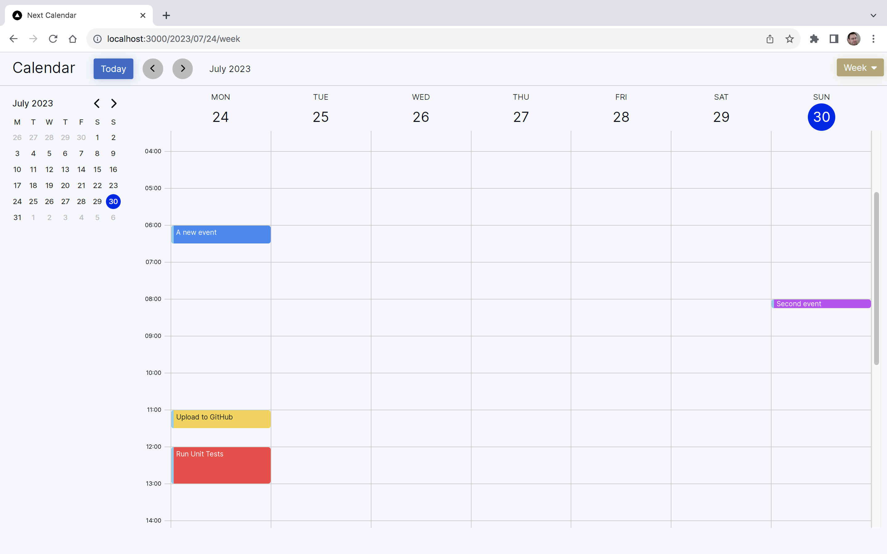

# Next Calendar

A calendar application created using Next.js



## Installation

First cone this repo.

```bash
git clone https://github.com/srayner/next-calendar.git
```

Then change directory into the installation folder.

```bash
cd next-calendar.git
```

Finally install the dependencies

```bash
npm install
```

## Getting Started

First, run the development server:

```bash
npm run dev
```

Navigate to [http://localhost:3000](http://localhost:3000) with your browser..
